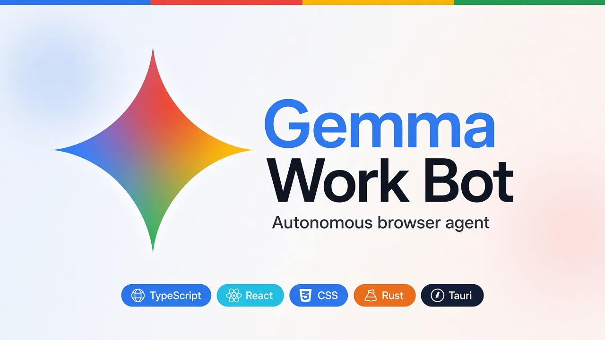

# Gemma Work Bot

<p align="center">
  
</p>

<p align="center">
  
  
  
  
  
</p>

A Google Gemma inspired WorkBot that gets your browser work done. Built with Tauri 2, React, TypeScript, CSS, and Rust, talking to Ollama Cloud or the Google Gemma API through Chrome DevTools Protocol.

## Features

- Full-page visual scan before acting
- Chrome clicking, typing, scrolling, forms, tabs, and navigation
- Reference-image comparison with high-detail screenshots
- Mandatory field review before Submit, Send, Save, Confirm, or payment
- Autonomous task loop with a 777-step ceiling
- Persistent isolated Chrome profile that remembers website sessions
- Windows, Linux x64/ARM64, macOS Apple Silicon/Intel, and Chromebook-via-Linux builds

## Install

Download the installer for your operating system from [Releases](https://github.com/AaronGrace978/WorkBot/releases).

Chromebooks cannot run a native ChromeOS build. Enable Linux in ChromeOS settings, then install the `.deb` from the Linux ARM64 release (most Chromebooks) or the Linux x64 release (Intel Chromebooks). You still need Chrome inside that Linux environment, or a Chromium package the bot can launch.

1. For Google Gemma models, create a key at [Google AI Studio](https://aistudio.google.com/apikey). For Ollama Cloud models, create a key at [ollama.com/settings/keys](https://ollama.com/settings/keys).
2. Open Gemma Work Bot, pick a model, and paste the matching key into Agent settings.
3. Sign into websites once in the separate Work Bot Chrome window.
4. Describe the outcome you want. Attach reference images when useful.

Current Chrome versions block remote debugging of the normal browser profile. Work Bot therefore uses its own persistent profile and never restarts or closes normal Chrome.

## Development

Prerequisites: Node.js 20+, stable Rust, the [Tauri 2 system dependencies](https://v2.tauri.app/start/prerequisites/), and Google Chrome or Chromium.

```bash
npm install
npm run tauri dev
```

On Windows, `start.bat` builds the release app once and launches that executable on later runs.

## Model and privacy

Use a Google Gemma API key from [Google AI Studio](https://aistudio.google.com/apikey) for hosted Gemma 4/3 models, or an [Ollama Cloud](https://ollama.com/settings/keys) key for Ollama Gemma models. Screenshots, page text, prompts, and attached images are sent to the selected provider. Website sessions stay in Work Bot's local Chrome profile.

Inspired by Google's Gemma (not an official Google product). This independent project is not affiliated with or endorsed by Google.
